# SkiaSharp Games

A small arcade game gallery built with **SkiaSharp** and **.NET 10 Blazor WebAssembly**.

The goal of this repo is not to build a giant engine. It is to keep a tiny, readable 2D toolkit that makes it easy to ship games like Breakout, Castle Attack, and Sink Sub with minimal boilerplate.

🎮 **Play on GitHub Pages:** <https://mattleibow.github.io/SkiaSharpGames/>

📘 **Engine reference:** [docs/game-engine.md](docs/game-engine.md)

🕹️ **Gameplay docs:** [Breakout](docs/games/breakout.md) · [Castle Attack](docs/games/castle-attack.md) · [Sink Sub](docs/games/sink-sub.md) · [2048](docs/games/2048.md)

## Games

| Game | URL | Description |
|------|-----|-------------|
| [Breakout](src/BlazorApp/Games/Breakout/) | `/games/breakout` | Classic brick-breaker with power-ups and paddle-angle control. |
| [Castle Attack](src/BlazorApp/Games/CastleAttack/) | `/games/castle-attack` | Defend layered castle walls with archers, workers, and special weapons. |
| [Sink Sub](src/BlazorApp/Games/SinkSub/) | `/games/sink-sub` | Patrol the surface, drop depth charges, and sink submarines before their mines hit your ship. |
| [2048](src/TwoZeroFourEight/) | `/games/2048` | Slide tiles on a 4×4 grid, merge matching numbers, and reach the 2048 tile. |

### Breakout

| Desktop | Mobile |
|---------|--------|
| 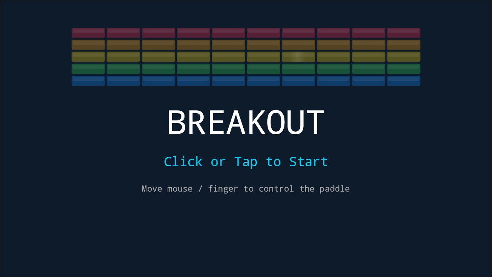 | 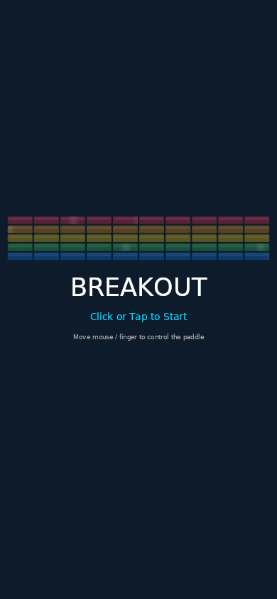 |
| 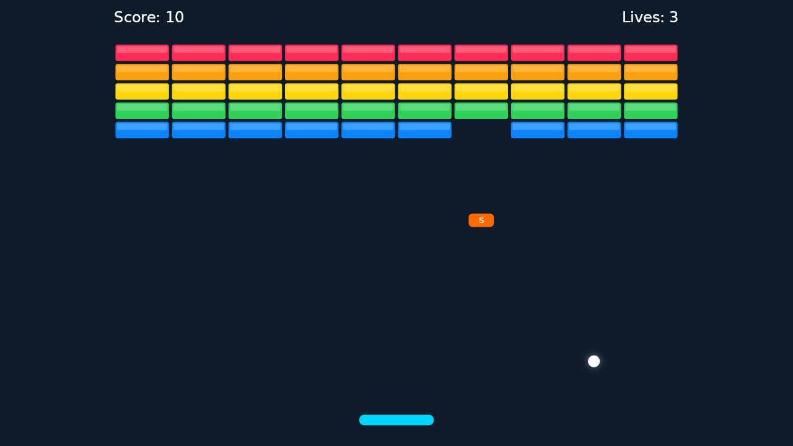 | 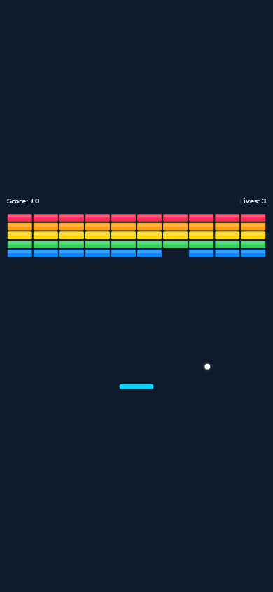 |

**Highlights:** circle-vs-rect collisions, wall bounds, animated paddle width, falling power-ups, and simple score/life rules.

### Castle Attack

| Desktop | Mobile |
|---------|--------|
| 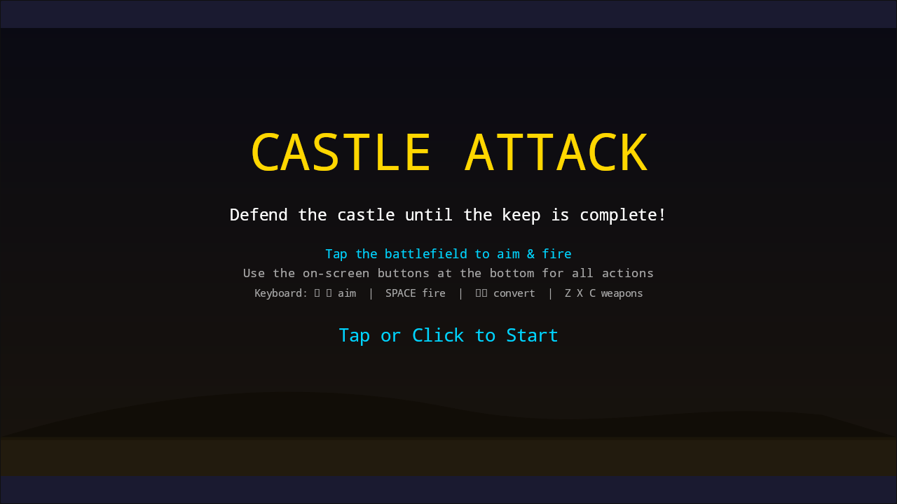 | 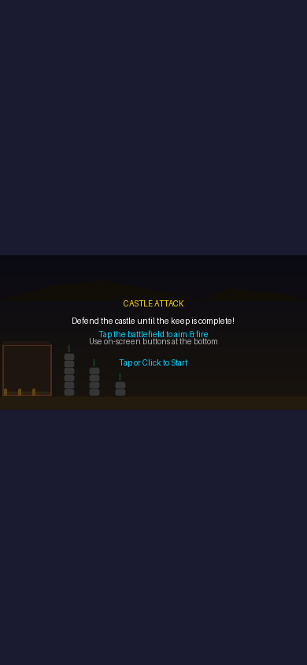 |
| 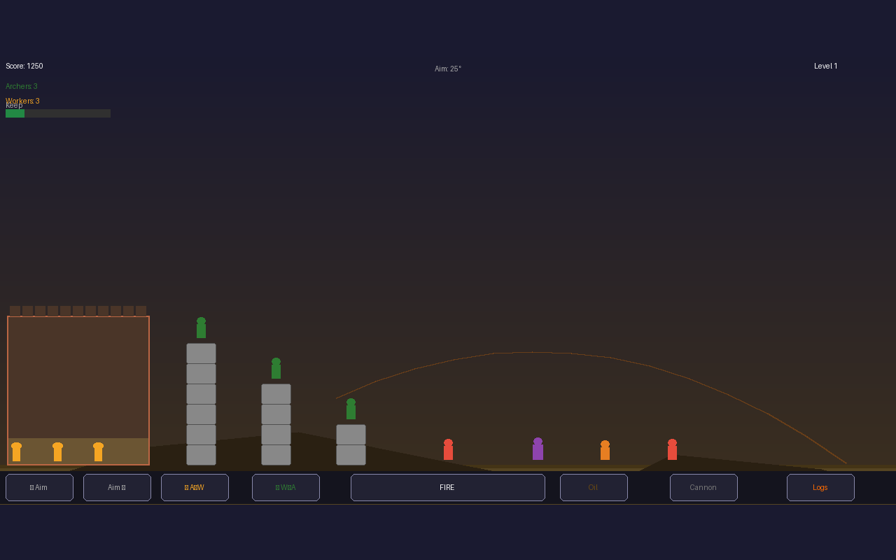 | 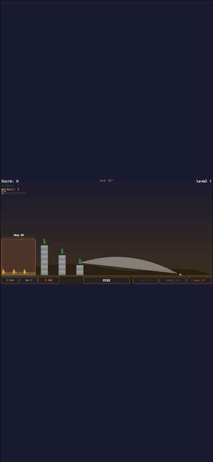 |

**Highlights:** archer volleys, enemy waves, destructible walls, builder swapping, and one-use special weapons.

### Sink Sub

| Desktop | Mobile |
|---------|--------|
| 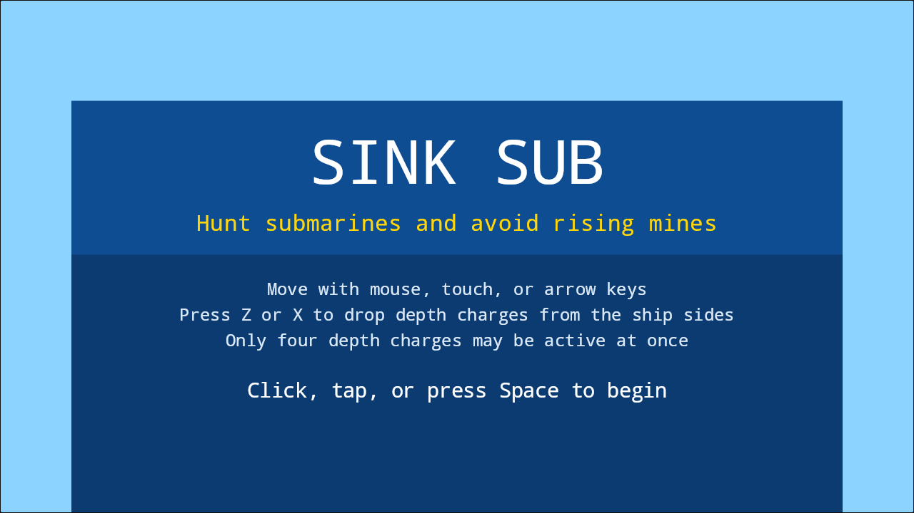 | 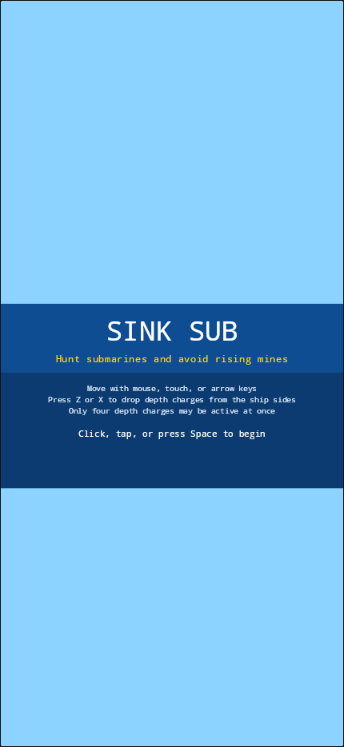 |
| 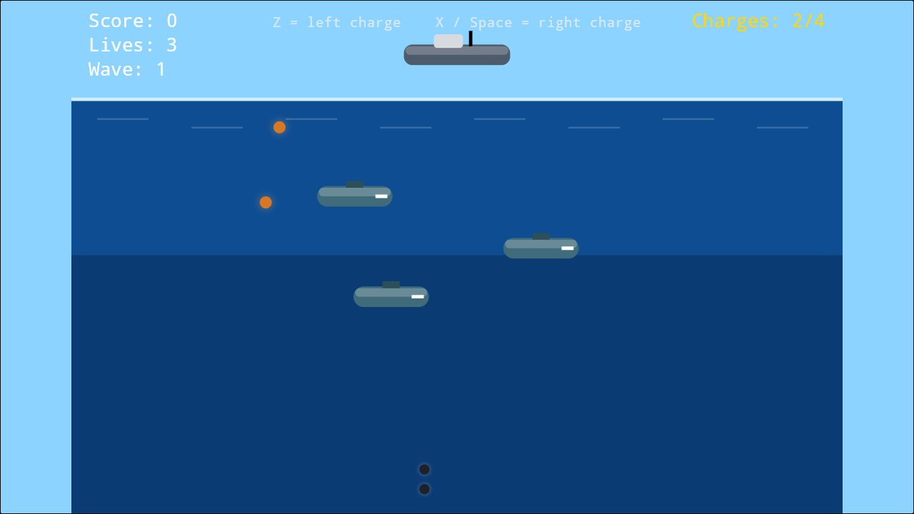 | 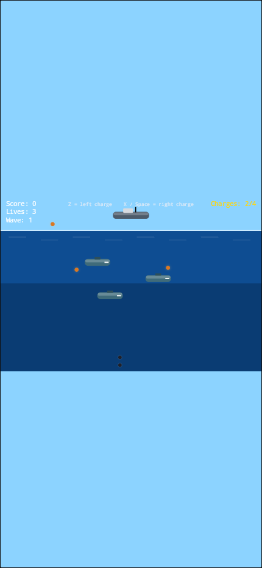 |

**Highlights:** surface movement, left/right depth-charge drops, wave-based submarine patrols, and rising mine hazards.

### 2048

| Desktop | Mobile |
|---------|--------|
|  |  |
|  |  |

**Highlights:** sliding tile animations, per-tile colour gradients, swipe input, score tracking, and spawn/merge effects.

## Project structure

```text
SkiaSharpGames.slnx

src/
  GameEngine/                   # Shared engine library
    Game.cs                     # Runtime host used by GameView
    GameBuilder.cs              # Game construction + screen/service registration
    Entity.cs                   # Center-based world position + Active flag
    Sprite.cs                   # Abstract sprite base
    CountdownTimer.cs           # Simple cooldown / duration timer
    Animation/
      AnimatedFloat.cs
      Easing.cs
      LoopedAnimation.cs
    Physics/
      Collider2D.cs             # Common collider base
      CircleCollider.cs
      RectCollider.cs
      Rigidbody2D.cs            # Velocity + bounce helpers
      CollisionResolver.cs      # Overlap tests, hit normals, bounds handling
      CollisionHit.cs
      GameBounds.cs
    Screens/
      GameScreen.cs
      ScreenCoordinator.cs
    Transitions/
      IScreenTransition.cs
      DissolveTransition.cs
      FadeToColorTransition.cs
      SlideTransition.cs

  Breakout/                     # SkiaSharpGames.Breakout class library
    BreakoutGame.cs
    BallSprite.cs, BrickSprite.cs, PaddleSprite.cs, PowerUpSprite.cs
    PlayScreen.cs, StartScreen.cs, GameOverScreen.cs, VictoryScreen.cs
    TextRenderer.cs             # Game-local text/overlay helper

  CastleAttack/                 # SkiaSharpGames.CastleAttack class library
    CastleAttackGame.cs
    EnemySprite.cs, ArrowSprite.cs, BoulderSprite.cs, WallBlockSprite.cs
    ArcherSprite.cs, WorkerSprite.cs, LordSprite.cs
    FloatTextSprite.cs, ButtonSprite.cs
    PlayScreen.cs, StartScreen.cs, GameOverScreen.cs, VictoryScreen.cs
    TextRenderer.cs

  SinkSub/                      # SkiaSharpGames.SinkSub class library
    SinkSubGame.cs
    ShipSprite.cs, SubmarineSprite.cs, MineSprite.cs, DepthChargeSprite.cs
    PlayScreen.cs, StartScreen.cs, GameOverScreen.cs
    TextRenderer.cs

  TwoZeroFourEight/             # SkiaSharpGames.TwoZeroFourEight class library
    TwoZeroFourEightGame.cs
    PlayScreen.cs, StartScreen.cs, GameOverScreen.cs

  BlazorApp/                    # Blazor WebAssembly host
    Pages/
      Home.razor
      Games/
        Breakout.razor
        CastleAttack.razor
        SinkSub.razor
        TwoZeroFourEight.razor
    Shared/
      GameView.razor

tests/
  GameEngine.Tests/
```

## Engine overview

The engine uses one small, consistent mental model:

1. **`Entity`** owns world position.
2. **`Rigidbody2D`** moves the entity.
3. **`Collider2D`** describes the hit shape.
4. **`CollisionResolver`** detects overlaps and produces bounce data.
5. The game decides what a hit means: score, damage, bounce, destroy, spawn, or ignore.

### Typical gameplay loop

```csharp
ball.Rigidbody.SetVelocity(140f, -220f);
ball.Rigidbody.Step(ball, deltaTime);

if (CollisionResolver.TryGetHit(ball, ball.Collider, paddle, paddle.Collider, out var hit))
{
    ball.Rigidbody.Bounce(hit);
}
```

This keeps the engine deliberately small and explicit. There is no hidden solver, no duplicate position state, and no second physics model to keep in sync.

### Core engine pieces

| Type | Purpose |
|------|---------|
| `Game` | Root runtime object hosted by the Blazor view |
| `GameBuilder` | Registers screens, services, assets, and the initial screen |
| `GameScreen` | One gameplay mode or overlay |
| `Entity` | Center-based object position |
| `Sprite` | Abstract visual base; concrete sprites live with each game |
| `Rigidbody2D` | Velocity and bounce helpers |
| `CircleCollider` / `RectCollider` | Simple arcade hit shapes |
| `CollisionResolver` | Overlaps, collision normals, wall/bounds resolution |
| `CountdownTimer` | Cooldowns and temporary effects |
| `AnimatedFloat` / `LoopedAnimation` | Smooth values and repeating effects |

Concrete visuals such as Breakout bricks/balls, Castle Attack enemies/archers, or Sink Sub ships/submarines live in their own game libraries. Each game is a standalone class library (`SkiaSharpGames.<GameName>`) that references only the engine and SkiaSharp. The engine keeps only the sprite contract — no shared drawing helpers. Each game owns its own `TextRenderer` for text/overlay rendering with cached paints and fonts.

## Adding a new game

1. Create a new class library under `src/<GameName>/` named `SkiaSharpGames.<GameName>`.
2. Reference `SkiaSharpGames.GameEngine` and `SkiaSharp`.
3. Build the game with `GameBuilder.CreateDefault()`.
4. Register one or more `GameScreen` types and set the initial screen.
5. Create sprites for all game visuals with cached `SKPaint` fields.
6. Add a `TextRenderer` static class for text/overlay drawing.
7. Add the project to the solution and reference it from `BlazorApp`.
8. Add a page in `src/BlazorApp/Pages/Games/`.
9. Register the game in `Program.cs` as a keyed service.
10. Add a card to `Home.razor`.
11. Add four screenshots under `docs/screenshots/<slug>/`.
12. Update this README and the engine docs.

## Testing

The engine is covered by xUnit tests for animation, screen flow, timers, drawing helpers, and the simplified physics/collision layer.

```bash
dotnet test --nologo
```

## Getting started

### Prerequisites

- [.NET 10 SDK](https://dotnet.microsoft.com/download)
- `wasm-tools` workload

```bash
dotnet workload install wasm-tools
```

### Run locally

```bash
cd src/BlazorApp
dotnet watch run
```

### Publish for GitHub Pages

```bash
dotnet publish src/BlazorApp/SkiaSharpGames.BlazorApp.csproj -c Release -o dist
```

## CI/CD

The workflow in `.github/workflows/deploy.yml` builds and deploys the Blazor app to GitHub Pages on push and pull request updates.
