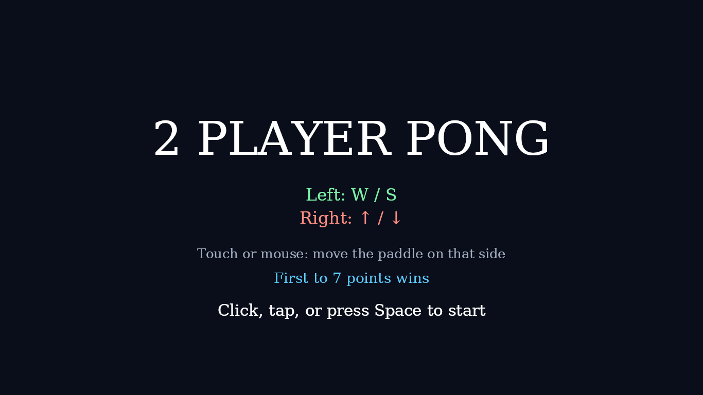
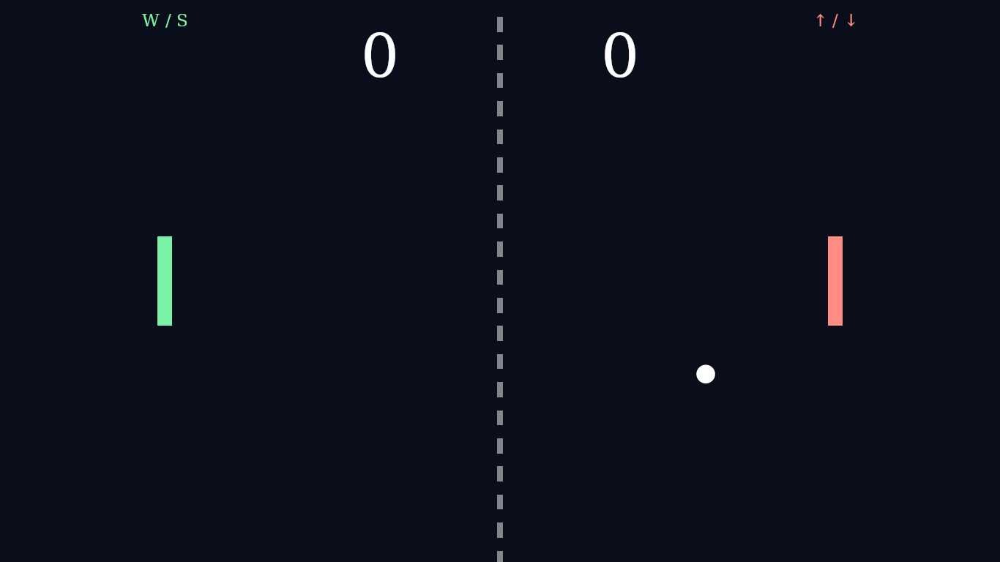
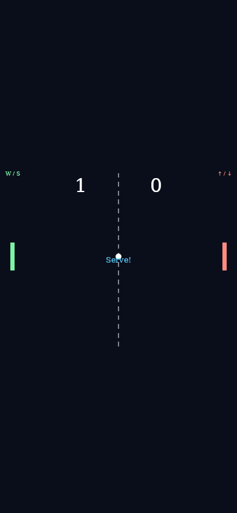

# Pong gameplay guide

## Overview

Pong is a local two-player paddle duel:

- defend your side
- bounce the ball back
- outplay the other player to 7 points

## Objective

Score 7 points before your opponent.

## Controls

| Input | Action |
|------|--------|
| W / S | Move left paddle up/down |
| Arrow Up / Arrow Down | Move right paddle up/down |
| Mouse / touch move | Move the paddle on that side of the screen |
| Click / tap / Space on title screen | Start or restart |

## Gameplay rules

- The ball bounces off paddles and the top/bottom walls.
- If the ball leaves the left edge, the right player scores.
- If the ball leaves the right edge, the left player scores.
- Paddle contact adds angle/spin based on where the ball hits.
- Ball speed ramps up through rallies.

## Screenshots

| Desktop | Mobile |
|---------|--------|
|  |  |
|  |  |
